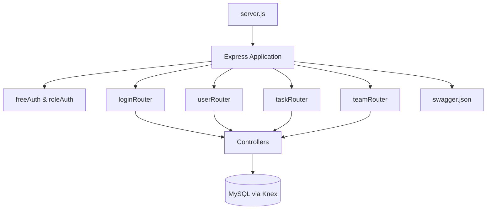
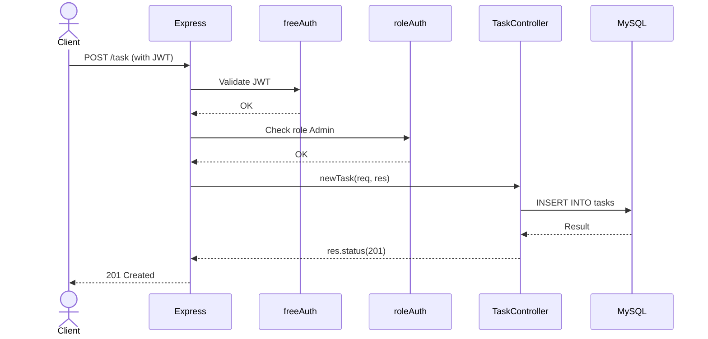
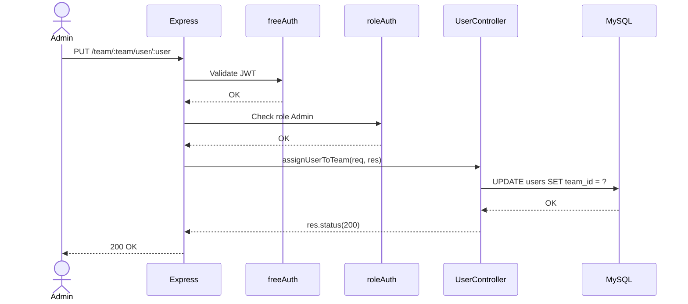
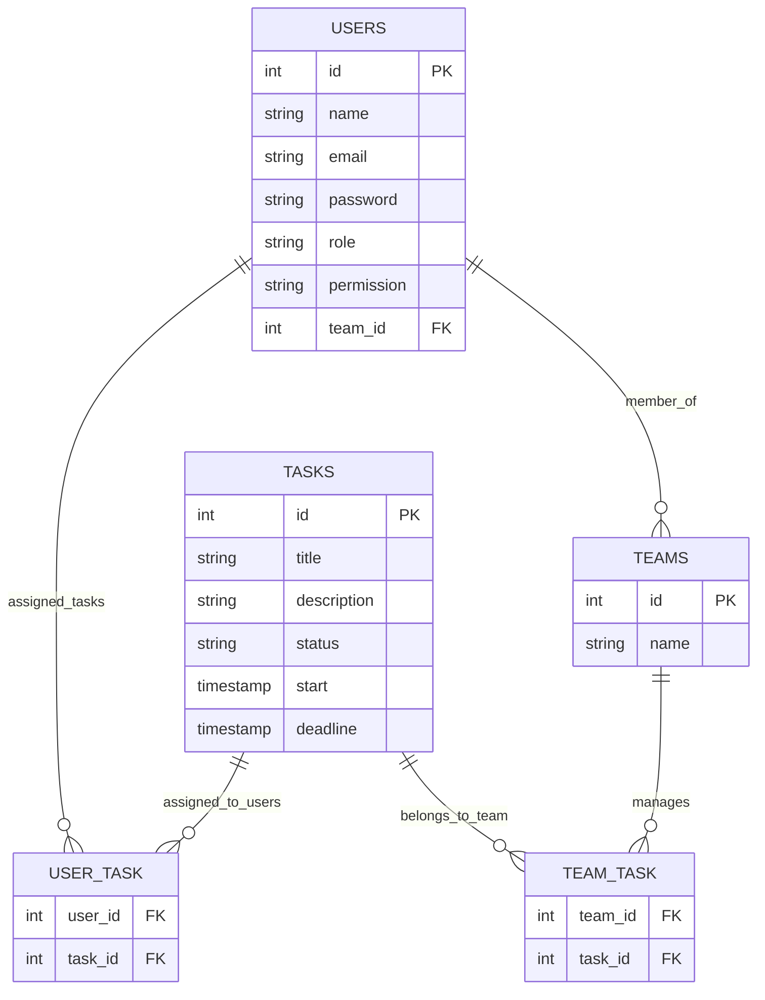

# Task Collaboration Project

[](https://example.com)
[](LICENSE)
[](https://developer.mozilla.org/en-US/docs/Web/JavaScript)

🚀 Built with ❤️ by Gabriel Hartmann, Nicolas Donato, and Tione Oliveira

---

## Table of Contents

- [Overview](#overview)
- [Getting Started](#getting-started)
  - [Prerequisites](#prerequisites)
  - [Installation](#installation)
  - [Usage](#usage)
  - [Testing](#testing)
- [API Documentation](#api-documentation)
- [UML Diagrams](#uml-diagrams)
- [Frontend Dashboard](#frontend-dashboard)
- [License](#license)

---

## Overview

**Task Collaboration Project** is a backend API that enables task, user, and team management through a secure, modular, and role-based approach.

### Key Features

- ✅ **RESTful API** for managing users, tasks, and teams
- 🔐 **JWT Authentication & Role-Based Access Control**
- 🧩 **Modular architecture** using Express, Controllers, Middleware
- 📦 **Swagger UI** for live API documentation
- 🧪 **Integrated testing** with Jest & Supertest
- 🗂️ **Data integrity** via MySQL and Knex.js

---

## Getting Started

### Prerequisites

- Node.js and npm 
- MySQL

### Installation

```bash
git clone https://github.com/tioneOliveira/taskcolaborationproject.git
cd taskcolaborationproject
npm install
```

### Usage

First of all, you will need to configure .evn file withing the project root directory . It should look something like this:

```bash
LISTENING_TO_PORT =  your_port
DATABASE_CLIENT = 'mysql2'
DATABASE_HOST = 'localhost (or desired host)'
DATABASE_USER = 'your_db_user (or root, by mysql12 default) '
DATABASE_PASSWORD = 'your_db_password'
DATABASE_NAME = 'your_db_name'
```
If you want to set up the mailer functionallity, you will have to register a e-mail and password in the .env file:
Add the following line in the .env, otherwise note that it will fail the automated test ---> test:user_task.

```bash
EMAIL_USER= 'your_mail_server_adress'
EMAIL_PASSWORD= 'your_mail_server_specific_password'
EMAIL_SERVICE= 'your_mail_provider'
```
And you must set up a JWT secrect key, to generate one you simply execute this code in any terminal where node.js is available:

```bash
node -e "console.log(require('crypto').randomBytes(32).toString('hex'))"

```
``` bash
JWT_SECRET_KEY = 'your_jwt_secrect_key'

```

Set up your database using mysql12 

Connect with the database in the matching port where you will run the aplication.

run the initilization command:

```bash
npm run initilize
```

### Testing

The test are automatically conducted when running the ```npm initialize``` command.


---

## API Documentation

Visit: http://localhost:[your_port]/api-docs) for swagger documentation.

---

## UML Diagrams

### 🧭 Use Case Diagram

```mermaid
%%{init: {'theme': 'default'}}%%
graph TD
  user[User]
  login[Login]
  createUser[Create User]
  deleteUser[Delete User]
  updateUser[Update User]
  assignUserToTeam[Assign User to Team]
  assignUserTask[Assign Task to User]
  listUserTasks[List User Tasks]
  listUser[List User Info]
  listAllUsers[List All Users]

  createTeam[Create Team]
  deleteTeam[Delete Team]
  updateTeam[Update Team]
  listTeams[List Teams]
  listTeamTasks[List Team Tasks]
  listTeamUsers[List Team Users]

  createTask[Create Task]
  deleteTask[Delete Task]
  updateTask[Update Task]
  listTasks[List All Tasks]
  getTask[Get Task Details]

  user --> login
  user --> createUser
  user --> deleteUser
  user --> updateUser
  user --> assignUserToTeam
  user --> assignUserTask
  user --> listUserTasks
  user --> listUser
  user --> listAllUsers

  user --> createTeam
  user --> deleteTeam
  user --> updateTeam
  user --> listTeams
  user --> listTeamTasks
  user --> listTeamUsers

  user --> createTask
  user --> deleteTask
  user --> updateTask
  user --> listTasks
  user --> getTask
```



---

### 🧱 Component Diagram



---

### 🔁 Sequence Diagram – Create Task



---

### 🔁 Sequence Diagram – Assign User to Team



---

### 🗃️ Entity-Relationship Diagram – Logical Overview



---

## 🎨 Frontend Dashboard

A dashboard made for navegating this api!

```bash
git clone https://github.com/NicolasDonatoSilveira/taskproj.git
cd taskproj
npm install
npm run dev
```
Log in with an administrator:
```bash
Email: tionefilho@gmail.com
Password: tione123
```
## 📄 License

This project is licensed under the **GNU License**.
