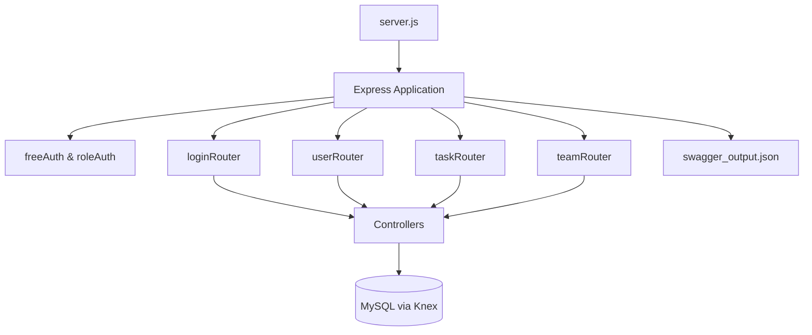
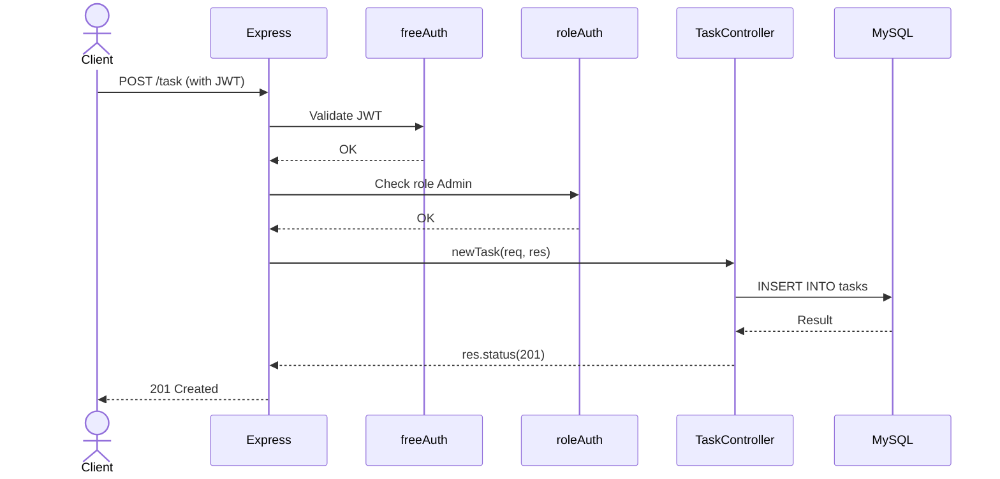
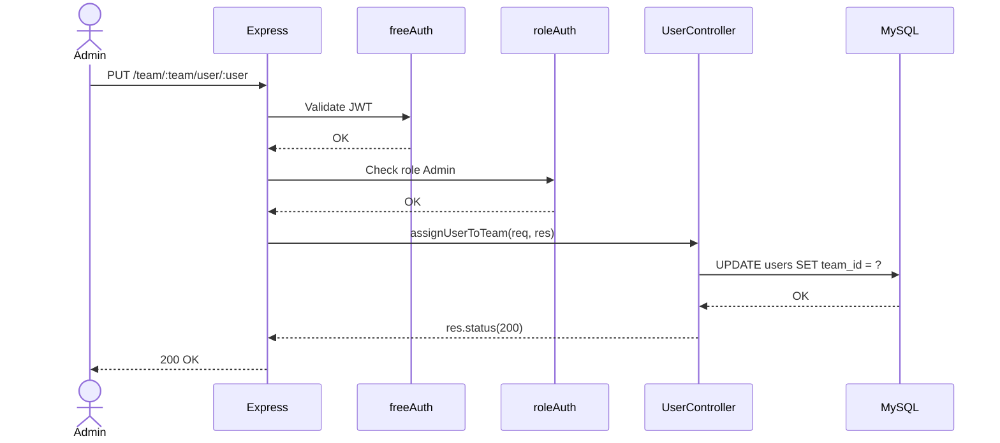
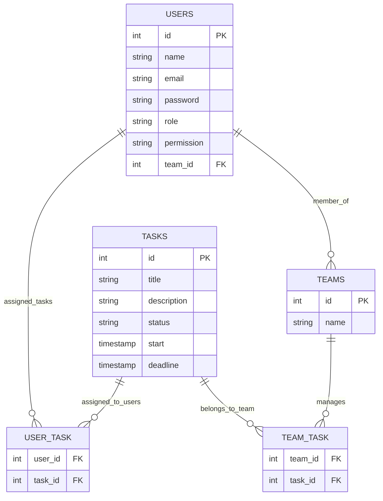

# Task Collaboration Project

[](https://example.com)
[](LICENSE)
[](https://developer.mozilla.org/en-US/docs/Web/JavaScript)

🚀 Built with ❤️ by Gabriel Hartmann, Nicolas Donato, and Tione Oliveira

---

## Table of Contents

- [Overview](#overview)
- [Getting Started](#getting-started)
  - [Prerequisites](#prerequisites)
  - [Installation](#installation)
  - [Environment Configuration](#environment-configuration)
  - [Usage](#usage)
  - [Testing](#testing)
- [API Documentation](#api-documentation)
- [UML Diagrams](#uml-diagrams)
- [License](#license)

---

## Overview

**Task Collaboration Project** is a backend API that enables task, user, and team management through a secure, modular, and role-based approach.

### Key Features

- ✅ **RESTful API** for managing users, tasks, and teams
- 🔐 **JWT Authentication & Role-Based Access Control**
- 🧩 **Modular architecture** using Express, Controllers, Middleware
- 📦 **Swagger UI** for live API documentation
- 🧪 **Integrated testing** with Jest & Supertest
- 🗂️ **Data integrity** via MySQL and Knex.js

---

## Getting Started

### Prerequisites

- Node.js and npm
- MySQL

### Installation

```bash
git clone https://github.com/username/taskcolaborationproject.git
cd taskcolaborationproject
npm install
```

### Environment Configuration

Create a `.env` file at the root with the following content:

```env
LISTENING_TO_PORT=3000
NODE_ENV=development
```

---

### Usage

```bash
npm start
```

Then visit: [http://localhost:3000/api-docs](http://localhost:3000/api-docs)

> On `npm start`, Swagger documentation is auto-generated via [swagger-autogen](https://github.com/davibaltar/swagger-autogen).
> You don't need to manually edit `swagger_output.json`.

---

### Testing

```bash
npm test
```

---

## API Documentation

Access the live interactive documentation:

- [Swagger UI](http://localhost:3000/api-docs)
- [OpenAPI JSON](./swagger_output.json)

---

## UML Diagrams

### 🧭 Use Case Diagram

```mermaid
%%{init: {'theme': 'default'}}%%
graph TD
  user[User]
  login[Login]
  createUser[Create User]
  deleteUser[Delete User]
  updateUser[Update User]
  assignUserToTeam[Assign User to Team]
  assignUserTask[Assign Task to User]
  listUserTasks[List User Tasks]
  listUser[List User Info]
  listAllUsers[List All Users]

  createTeam[Create Team]
  deleteTeam[Delete Team]
  updateTeam[Update Team]
  listTeams[List Teams]
  listTeamTasks[List Team Tasks]
  listTeamUsers[List Team Users]

  createTask[Create Task]
  deleteTask[Delete Task]
  updateTask[Update Task]
  listTasks[List All Tasks]
  getTask[Get Task Details]

  user --> login
  user --> createUser
  user --> deleteUser
  user --> updateUser
  user --> assignUserToTeam
  user --> assignUserTask
  user --> listUserTasks
  user --> listUser
  user --> listAllUsers

  user --> createTeam
  user --> deleteTeam
  user --> updateTeam
  user --> listTeams
  user --> listTeamTasks
  user --> listTeamUsers

  user --> createTask
  user --> deleteTask
  user --> updateTask
  user --> listTasks
  user --> getTask
```



---

### 🧱 Component Diagram



---

### 🔁 Sequence Diagram – Create Task



---

### 🔁 Sequence Diagram – Assign User to Team



---

### 🗃️ Entity-Relationship Diagram – Logical Overview



---

## 📄 License

This project is licensed under the **GNU License**.
