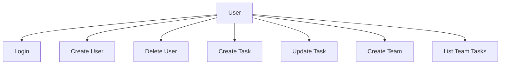
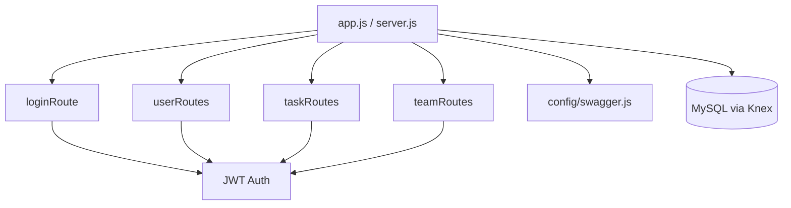
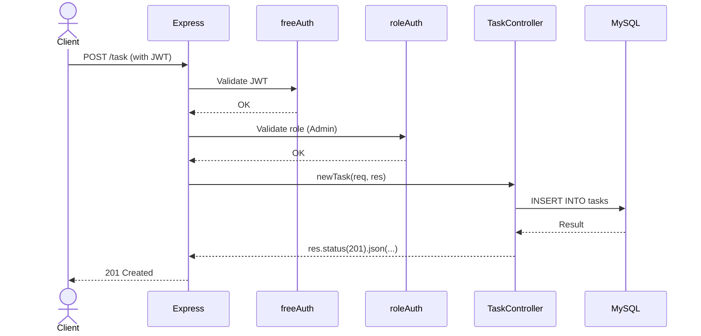

# Task Collaboration Project

> Empower teams, streamline tasks, achieve greatness together.

[](https://example.com)
[](LICENSE)
[](https://developer.mozilla.org/en-US/docs/Web/JavaScript)

🚀 Built with ❤️ by Tione Oliveira, Gabriel Hartmann and Nicolas Donato

---

## Table of Contents

- [Overview](#overview)
- [Getting Started](#getting-started)
  - [Prerequisites](#prerequisites)
  - [Installation](#installation)
  - [Usage](#usage)
  - [Testing](#testing)
- [API Documentation](#api-documentation)
- [UML Diagrams](#uml-diagrams)
- [License](#license)

---

## Overview

**Task Collaboration Project** is a backend API that enables task, user, and team management through a secure, modular, and role-based approach.

### Key Features

- ✅ **RESTful API** for creating, updating, deleting, and managing users, tasks, and teams.
- 🔐 **JWT Authentication with Role-Based Access Control**.
- 🧩 **Modular structure** using Express.js, Knex, and MySQL.
- 📦 **Integrated Swagger UI** for live API documentation.
- ⚙️ **Testable architecture** with Jest and Supertest support.

---

## Getting Started

### Prerequisites

- **Node.js** and **npm**
- **MySQL** database

---

### Installation

```bash
git clone https://github.com/username/taskcolaborationproject.git
cd taskcolaborationproject
npm install
```

---

### Usage

```bash
npm start
```

Then visit: [http://localhost:3000/api-docs](http://localhost:3000/api-docs)

---

### Testing

```bash
npm test
```

---

## API Documentation

Access the live interactive documentation:

[http://localhost:3000/api-docs](http://localhost:3000/api-docs)

---

## UML Diagrams

### 🧭 Use Case Diagram



---

### 🧱 Component Diagram



---

### 🔁 Sequence Diagram (Create Task)



---

## 📄 License

This project is licensed under the **GNU License**.
